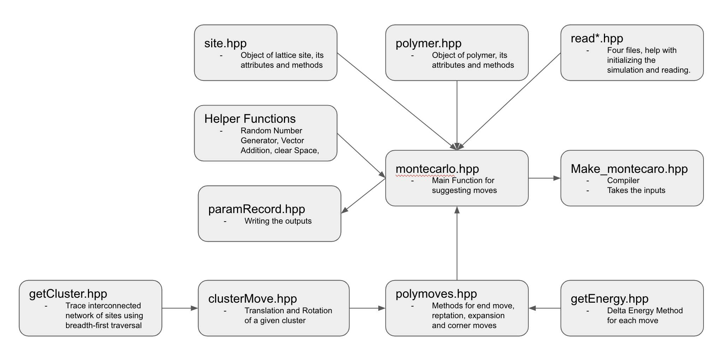

# Multicanonical Simulations for Ordered Proteins

This folder contains the source code for polymer Monte Carlo simulations in the Canonical Ensemble, with the option of including a "preweighting" file for multicanonical sampling. All code is written in C++17.

## Schematic of CodeBase



## Install

```
git clone https://github.com/BenjaminWeiner/condensates-sequence
cd condensate-sequence/multicanonical\ simulations/src
make
```


## Run the program

```
"./multicanonical multicanonical_name lattice_sc.txt polySpecs.txt annealing_schedule.txt 100 300000000 4000 interaction_energies.txt preweighting_file.txt 6920"
```

## Inputs

1. Simulation name for parameter record and all data
2. Lattice specification file
3. Polymer specification file
4. Simulated annealing schedule
- The first column is the beta (1/Temp) and the second column is the number of MC steps for that beta.

5. Initial polymer number
6. Monte Carlo steps
7. Write interval
8. Interaction energy file
9. Preweighting file for multicanonical simulations (includes chemical potential mu)
10. Seed for RNG

## Output

The simulation will produce 2 outputs:
1) A "paramRecord" file recording all parameters.
2) a "writeRecord" in the following format:
Step beta polymer-number energy

The full (x,y,z) coordinates at each step can be recorded by setting "writeFullConfig=true;" in main_multicanonical.cpp and recompiling.

For simulations without multicanonical sampling, use a preweighting file with P(N)=constant for all N. 
